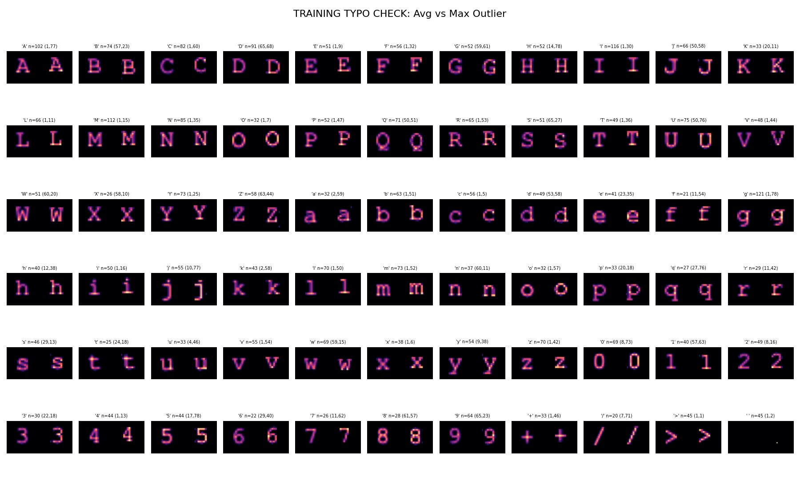

# Project Summary

If you're new here, this project was started in response to [an effort to extract some unredacted content in the Epstein archives](https://neosmart.net/blog/recreating-epstein-pdfs-from-raw-encoded-attachments/). The CNN in this repo was used to successfully exfiltrate [DBC12.pdf](https://archive.org/details/dbc-12-one-page-invite-with-reply) from [EFTA00400459](https://archive.org/details/efta-00400459_pages).

You can read about this code/approach here: [EFTA00400459 has been cracked, DBC12.pdf liberated](https://neosmart.net/blog/efta00400459-has-been-cracked-dbc12-pdf-liberated/).

The code in this project runs against the images extracted from the PDF with `pdfimages`, you can download [an archive containing them here](https://archive.org/details/efta-00400459_pages).

### Basic Usage Info

Expects `../EFTA00400459-{000..=075}_2x.png` to exist

* Run `./train.sh` to generate training from train_top.txt and train_bot.txt corresponding to page-001_2x.png
* Run `./run.sh` to OCR all pages and generated recovered.pdf

Trains from top of page-001 and bottom of page-001 non-contiguously to capture vertical drift.
Memorizes grid location and reuses for subsequent pages (non-training runs) to prevent pixel shifts.

In training runs with `-d`/`--debug`, generates a debug view that lets you see if you mis-typed anything by showing greatest outliers compared to the rest of the members assigned to the bucket:



In inference runs, generates a debug view (when `-d` is in use with no `-q`/`--quiet`) that shows the max outliers compared to the rest of the characters in the image. When `-o`/`--output` is specified, the debug view is saved to `<basename>-proof.png` so you can inspect it later.


### `ocr.py` (YOLO-based OCR pipeline)

This repo also contains a newer pipeline in `ocr.py` that:

- **Generates synthetic training data** (YOLO detection labels for characters).
- **Trains an Ultralytics YOLO model** for character detection.
- **Runs OCR on page images** (including wide-line sliding window inference).

#### Fonts

Synthetic generation uses **installed system fonts** discovered at runtime via `fc-list` and samples randomly per training image.
It targets these families when available:

- Courier New
- Liberation Mono
- DejaVu Sans Mono

If `fc-list` is unavailable or returns no matches, `ocr.py` falls back to a small list of common font file paths.

#### Dataset generation

```bash
uv run python ocr.py --generate --train-count 20000 --val-count 2000
```

To force a single font (useful for Courier-only fine-tuning):

```bash
uv run python ocr.py --generate --train-count 20000 --val-count 2000 --font-path /path/to/Courier_New.ttf
```

Arguments:

- `--train-count`
  Number of synthetic training images to generate (default: 5000)
- `--val-count`
  Number of synthetic validation images to generate (default: 1000)

#### Training

Quick sanity check:

```bash
uv run python ocr.py --train --epochs 2 --patience 1
```

Long run with early stopping:

```bash
uv run python ocr.py --train --epochs 300 --patience 30
```

Fine-tune from an existing run (example: `train13`):

```bash
uv run python ocr.py --train --epochs 15 --patience 3 --model runs/detect/train13/weights/best.pt
```

Arguments:

- `--epochs`
  Maximum training epochs (default: 100)
- `--patience`
  Early-stopping patience in epochs (default: 30)

#### Inference

```bash
uv run python ocr.py --predict /path/to/page.png --model runs/detect/train/weights/best.pt
```
